# tui-sudoku

tui-sudoku is a **configurable terminal interface sudoku game**, with quite a few features.

 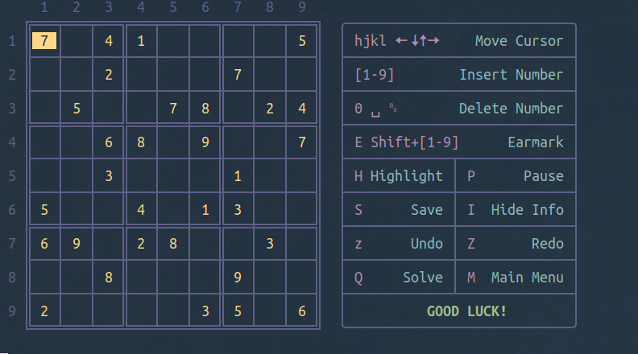


Starting the game, and through the **main menu**,
the player can :

- Start a new game

- Load previously saved game

- Configure some parameters (colors, preferred editor, puzzle symmetry,preffered png)

- exit the program

     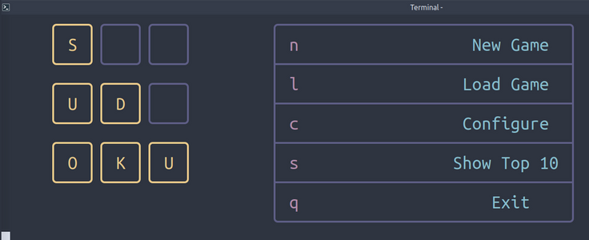

---

## PLAYING THE GAME

After choosing the `n New Game` option, the player can select the **level of difficulty**:

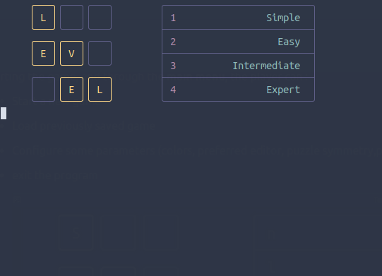

The user will be presented with the known **9x9 sudoku matrix**.

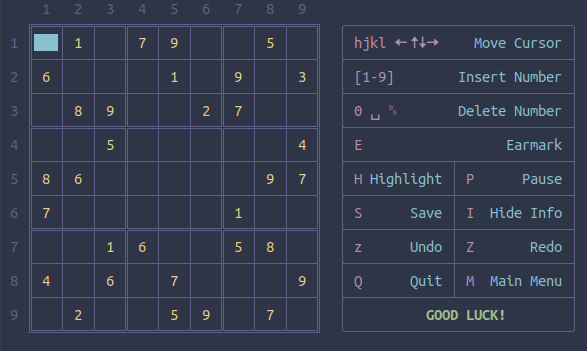

Using the shortcuts in the shown cheatsheet table, the player can


|Shortcuts     |Action     |
|-----|-----|
|  hjkl 🠄 🠅🠇🠆    | Move Cursor    |
| [1-9]    | Insert Number    |
|0,␣<space\>,␈<backspace\>       |Clear Cell     |
|  E  , or Shift+[1-9]| Earmark cells|
|H|Toggle Highlight Numbers|
|I|Toggle show Info (key cheatsheet)|
|P|Pause Game
|S|Save Game|
|z,Z| Undo / Redo |
|M|Return to Main Menu|
|Q|Show Solution & Quit|


---

- Typing `H` while the cursor is on a number, e.g. 2, will **highlight** all the 2s in the matrix.

    Typing `H` again will **undo the highlighting**.

    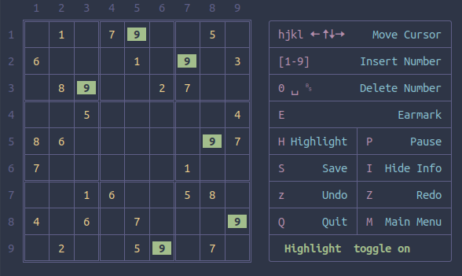

- Typing `E` and entering up to 3 digits, or entering `Shift`+<number\> will **earmark the cell**:

     

- Earmarking a cell with an **illegal number** (a number that *already exists in the row, the line or the 3x3 block*) will give an earmark with a different color, and a warning message:

    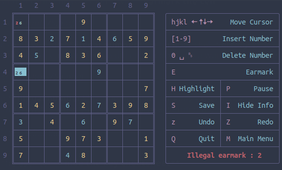

- Entering an **illegal number** (a number that *already exists in the row, the line or the 3x3 block*) will mark the number with a different color, and give a warning message:

    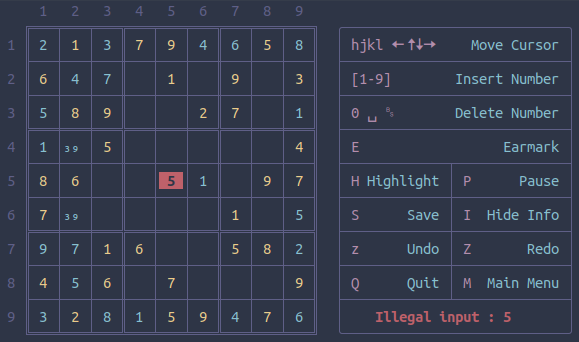


- Typing `I`, the user can **hide the key cheatsheet**.

    Typing `I` again will **show the key cheatsheet again**.

    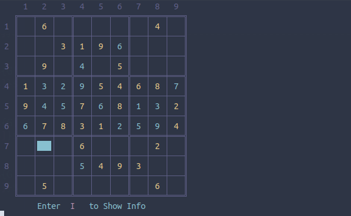

- Typing `P` will **pause the game.** By hitting any key, the user can return to the game.

    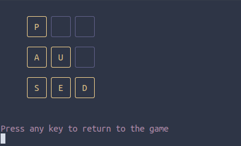

- The user can also **Undo** or **Redo** their entries with the `z` or `Z` option respectively.

- While the `M` option **returns to the `Main Menu`**, and the `S` option **saves the game**, the `Q` option **prints the solution and exits**:

    


---


Back in the `Main Menu`, the player can also

- **Load a previously saved game** with the `l` option

    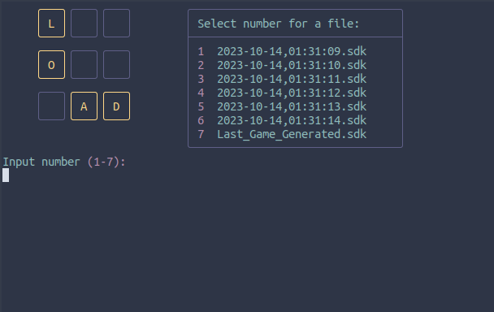

- **Configure** preferred _colors_, preferred _text editor_ and _puzzle symmetry_ with the `c` option

    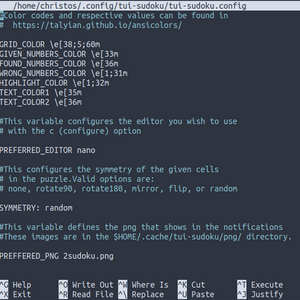

- or Browse the **Top Ten Scores** (`s` option)

    

---

## Configure

The configuration is kept in the `$HOME/.config/tui-sudoku/tui-sudoku.config` file.

If there is no file kept there, **default values will be loaded**.


- You can select the colors you like and the respective codes as they demonstrated here:

    [https://talyian.github.io/ansicolors/](https://talyian.github.io/ansicolors/)

  **Default colors**

  | Color    | Code    | Script Variable    |
  |-----|-----|-----|
  |Grid Color|\x1b[38;5;60m|	C1|
  |Given Numbers Color	|\e[1;33m|C2|
  |Found Numbers Color	|\e[1;36m|C3|
  |Wrong Numbers Color	|\e[1;31m|C4|
  |Highlight Color	|\e[1;32m|C5|
  |TextColor1	|\e[35m|C6|
  |TextColor1	|\e[36m|C7|

- `SYMMETRY` variable configures the symmetry of the given cells in the 9x9 matrix. Valid options are:
_none, rotate90, rotate180, mirror, flip, or random_

- `PREFFERED_PNG` variable defines the png that shows in the notifications. These images are located in the `$HOME/.cache/tui-sudoku/png/` directory.

     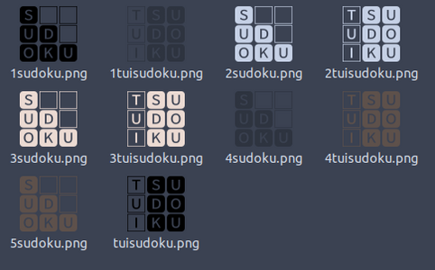

- `PREFERRED_EDITOR` variable configures the editor you wish to use with the `c` (configure) option.

---

## Dependencies

- [qqwing](https://qqwing.com/download.html) is the main dependency of this program, as it is the command line sudoku generator.

- [lolcat](https://github.com/busyloop/lolcat) is used to give more color to the `Top Ten` presentation.

In Debian based OSs, in order to install these dependencies:

```
sudo apt install qqwing lolcat
```

---

## INSTALL

Clone the repo, and change directory into the program's directory:
```
git clone https://gitlab.com/christosangel/tui-sudoku
cd tui-sudoku/
```
Make the `install.sh` script executable and run it:
```
chmod +x install.sh&&./install.sh
```

You are ready to go.

---

## RUN


- Open a terminal window, and **adjust the font size to your liking, using `Ctrl` `Shift` `+` or `Ctrl`  `-`**

- From the `tui-sudoku/` directory, run:

```
./tui-sudoku.sh
```

If in your system the directory `~/.local/bin` exists, and it is added to the`$PATH`, you can run:

```
tui-sudoku.sh
```


___Have fun!___
